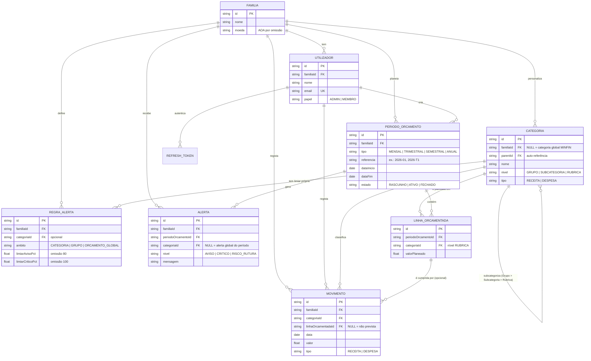

# Modelo conceptual

Este documento descreve as entidades do domínio, os seus atributos essenciais e as
relações entre elas, independentemente de qualquer motor de base de dados. A
implementação real (Prisma + SQLite) está em `docs/02-modelo-logico.md` e
`docs/03-modelo-fisico.md`.

## Diagrama entidade-relação

## Entidades

### Familia
A fronteira de "tenant" da aplicação: tudo o resto pertence a uma família. Guarda a
moeda usada nos relatórios (AOA por omissão, dado o contexto do documento MINFIN).

### Utilizador
Uma pessoa da família com acesso à aplicação. Tem um **papel**: `ADMIN` (normalmente
quem cria a família — pode criar orçamentos, convidar membros, ajustar linhas
orçamentadas) ou `MEMBRO` (pode registar movimentos e consultar tudo, mas não alterar
o plano). Um utilizador pertence a exatamente uma família.

### Categoria
Hierarquia de três níveis — **Grupo > Subcategoria > Rubrica** — transcrita
diretamente da planilha-modelo do MINFIN (ver `docs/00-filosofia.md`). É uma única
tabela auto-referenciada (`parentId`), não três tabelas separadas, para poder
representar tanto o caso com subcategoria (ex.: Despesas Fixas > Habitação >
Arrendamento) como o caso sem ela (ex.: Receitas > Salário Base, onde a Rubrica é
filha direta do Grupo). As categorias com `familiaId = NULL` são a árvore-modelo
partilhada por todas as famílias; cada família pode acrescentar as suas próprias por
cima (`familiaId = <a sua família>`), sem nunca poder apagar ou alterar a árvore
global.

### PeriodoOrcamento
Um exercício orçamental de uma família, com uma granularidade (Mensal, Trimestral,
Semestral ou Anual) e um intervalo de datas. Passa por três estados: `RASCUNHO`
(ainda a ser preparado), `ATIVO` (em curso — é contra os períodos `ATIVO` que os
movimentos e alertas são avaliados) e `FECHADO` (histórico, já não recebe alertas).

### LinhaOrcamentada
O valor planeado para **uma** Rubrica dentro de **um** PeriodoOrcamento — a unidade
atómica do domínio orçamental. Não pode haver duas linhas para a mesma
categoria no mesmo período (é o que a família "prometeu a si própria" gastar/receber
naquela rubrica).

### Movimento
Um lançamento real de receita ou despesa, do domínio de registo diário. A decisão de
desenho mais importante deste modelo: **um Movimento não tem uma referência direta a
um PeriodoOrcamento.** Pertence a um período apenas por a sua data cair dentro do
intervalo desse período — o que permite que o mesmo movimento conte, ao mesmo tempo,
para o relatório mensal, o trimestral, o semestral e o anual, sem duplicar dados. Já a
ligação a uma `LinhaOrcamentada` é direta e opcional: presente, o movimento é
**previsto**; `NULL`, é **não previsto** — o conceito de "desejo" vs. "necessidade"
do documento MINFIN tornado num campo de dados.

### RegraAlerta
Personalização, por família, dos limiares que disparam avisos — por omissão 80%
(aviso) e 100% (crítico) do valor planeado, aplicável a uma categoria específica, a um
grupo, ou ao orçamento global.

### Alerta
O resultado do motor de monitorização (`docs/03-modelo-fisico.md`): um aviso
concreto, gerado automaticamente, nunca escrito à mão por um utilizador.

## Cardinalidades-chave

- Uma Família tem muitos Utilizadores; um Utilizador pertence a uma só Família.
- Uma Categoria pode ter muitas Categorias-filhas (Grupo→Subcategoria→Rubrica); só as
  Rubricas podem ser planeadas (`LinhaOrcamentada`) ou usadas em `Movimento`.
- Um PeriodoOrcamento tem muitas LinhasOrcamentadas (uma por Rubrica planeada).
- Uma LinhaOrcamentada pode ter zero ou muitos Movimentos ligados (0 = ainda não se
  gastou nada dessa rubrica planeada); um Movimento liga-se a, no máximo, uma
  LinhaOrcamentada.
- Um PeriodoOrcamento pode gerar muitos Alertas ao longo do tempo (histórico).
